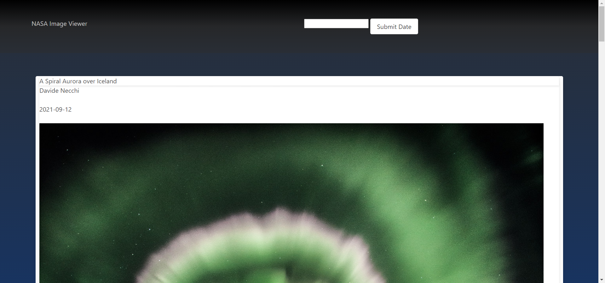
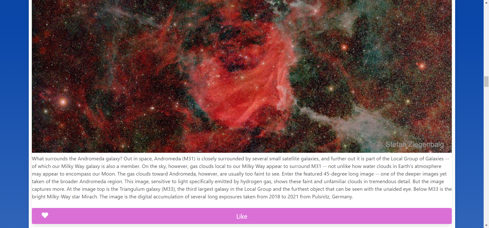
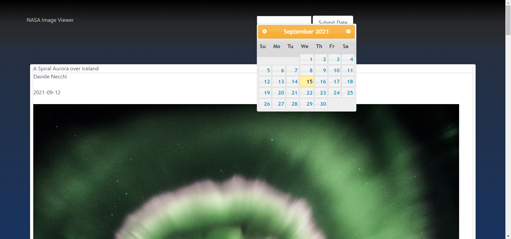

# NASA Image Viewer

## Table of Contents
- [Project Overview](#project-overview) 
- [Contributors](#contributors)
- [Live Application](#live-application)
- [Installation](#installation)
- [License](#license)
- [Screenshots](#screenshots)

## Project Overview
Application to view and like NASA APOD images.  Initially pulls up images from the last 4 days.  However, start date parameters are changeable.  

[View the live application](https://neighborhood-handyman.herokuapp.com/) in Heroku.

### Languages Used
- JavaScript
- HTML
- CSS

### Additional Libraries
- [Bulma]()
- [Font Awesome](https://fontawesome.com)
- [JQuery]()

## Contributors
- Elizabeth De Santis ([desantel](https://github.com/desantel))

## Live Application
[View application deployment](https://desantel.github.io/NASAimageViewer/) on GitHub Pages.

## Installation
No istallations used for the design of this application.  Cloning the repository and opening the index in your default browser is all that is required.

## License
Permission is hereby granted, free of charge, to any person obtaining a copy of this Software and associated documentation files (the "Software"), to deal in the Software without  restriction, including without limitation the rights to use, copy, modify, merge, publish distribute, sublicense, and/or sell copies of the Software, and to permit persons to whom the Software is furnished to do so, subject to the following conditions.

[View the full license](./LICENSE)

## Screenshots

